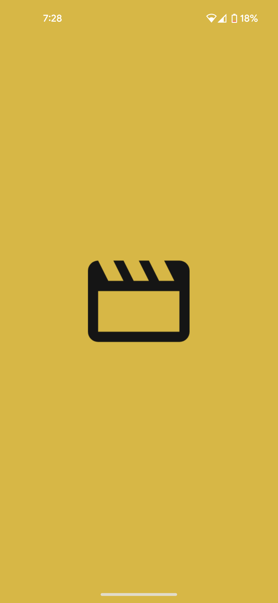
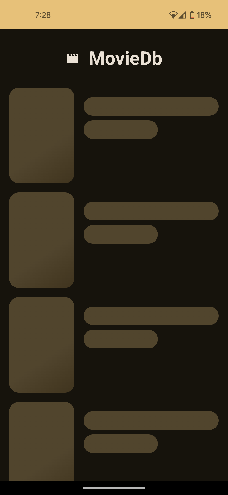
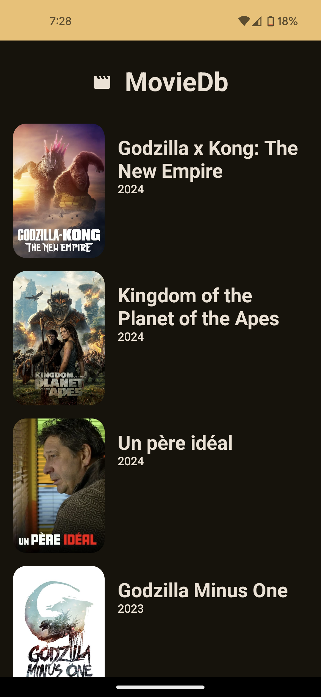
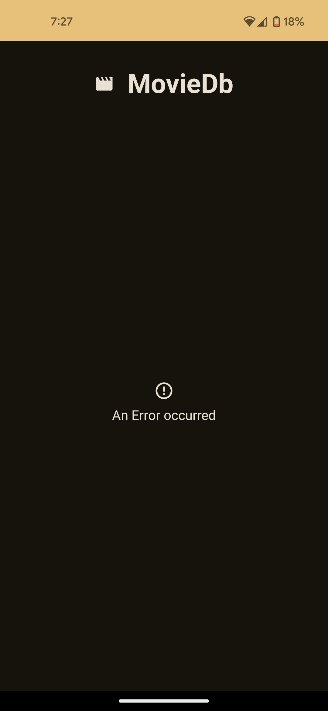

# Framework

The app is built on Kotlin Multiplatform which is a framework based on kotlin. The app shares
business logic between Android and IOS and other possible platforms (Desktop/Web).
Many of the libraries utilized are fully written in Kotlin. Whenever a Kotlin library is referenced,
I also include the commonly used Android variant in parentheses to illustrate what I would use if I
opted for the Kotlin library.

# Architecture

The project is structured into 4 main modules: `commonMain`, `androidMain`, `iosMain`
and `androidApp`.
`commonMain` contains the business logic (Data Layer) from the **DataSources** to **Repositories**
and **Models**
while `androidMain` contains the Android specific business logic. If there is a functionality that
is platform specific, it is declared in `commonMain` as `expect` and defined in both `androidMain`
and `iosMain` as `actual` with the implementation.
`androidApp` contains the UI Layer (Screens and ViewModels) and uses the Repository
from `commonMain`.

## Dependency Injection

`Koin` and `Hilt` are used for Dependency Injection. `Koin` is used on `commonMain` to provide the
Data
Source to the Repository and then provide the Repository. and `Hilt` is used on `androidApp`
receiving a
singleton of the Repository and providing it to the ViewModels. `Koin` was used on `commonMain`
because it is a 100% kotlin library and `Hilt` was used on `androidApp` because of it's
compatibility
with the Android Architecture.

# Data Handling

To properly handle data, provide a smooth and performant experience. Offline-First capability (To
use the app while offline) and Paging were considered.

- To achieve offline-first capability, `sqlDelight` (**Room**) could be used to save data locally
  when fetched but because of the lack of control over the API and the inability to receive changes
  list (Inserts/Updates) from the API the idea was dismissed.
- The App uses the Paging Library to fetch data based on the user's usage of the app so when the
  user reaches the end of the current page the next page is fetched.

`Ktor` (**Retrofit**) was used to fetch data from the API and for security reasons, `BuildKonfig`
(**Gradle Secrets**) was used to put the API Key on the `gradle.properties` inaccessible after build.

# User Interface

For UI, `Compose` (**XML**) was used which is a declarative UI framework. The `MainActivity` holds
on the `NavHost` which contains 2 screens (`HomeScreen` and `MovieScreen`). Each screens receives
their respective ViewModels provided by `Hilt` and collects the UiState and acts accordingly.
Also...

- The UI uses **Material3 Theme** which is the latest Google UI Standard.
- `Coil` (Glide) was used to Load the Images.
- For User Experience while the data is fetched, a shimmer effect is shown informing the user that
  the data is loading.
- Errors are handled and a Snackbar is shown with the Error Message.
- The ability to swipe to refresh so the user won't have to exist/re-enter the app.
- Splash Screen

# Screenshots

